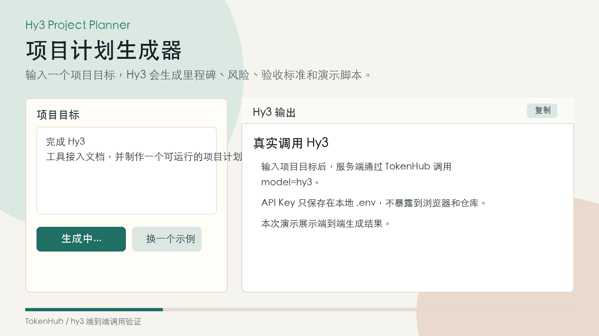

# Hy3 项目计划生成器

输入一个项目目标，应用调用 Hy3 生成里程碑、交付物、风险、验收标准、今日行动和演示脚本。

## 功能

- 使用腾讯云 TokenHub 的 OpenAI 兼容接口调用 Hy3。
- 在服务端读取 API Key，避免把密钥暴露到浏览器。
- 提供一个轻量 Web 工作台，适合录制 1 分钟以内演示。
- 无第三方依赖，Node.js 18+ 即可运行。

## 运行方式

复制环境变量示例：

```bash
cp .env.example .env
```

填写 `.env`：

```bash
TOKENHUB_API_KEY=你的 TokenHub API Key
PORT=8787
```

加载环境变量并启动：

```bash
set -a
source .env
set +a
npm start
```

浏览器打开：

```text
http://localhost:8787
```

## 配置项

| 变量 | 默认值 | 说明 |
| --- | --- | --- |
| `TOKENHUB_API_KEY` | 无 | 腾讯云 TokenHub API Key |
| `TOKENHUB_BASE_URL` | `https://tokenhub.tencentmaas.com/v1` | TokenHub OpenAI 兼容地址 |
| `HY3_MODEL` | `hy3` | 模型名 |
| `HOST` | `127.0.0.1` | 本地监听地址 |
| `PORT` | `8787` | 本地服务端口 |

## 演示录制脚本



录制 45-60 秒 GIF 或视频：

1. 展示首页，说明这是 Hy3 项目计划生成器。
2. 输入“完成 Hy3 在 5 个主流开发工具中的接入文档，并制作一个可运行示例”。
3. 点击“生成拆解计划”。
4. 展示 Hy3 返回的里程碑、风险、验收标准和今日行动。
5. 复制结果，说明可以直接用于项目执行和 PR 描述。

## 验证记录

已使用 TokenHub `hy3` 模型完成一次端到端调用验证。示例输入与返回结果见：

```text
assets/demo-output.md
```

## 与 Hy3 的关系

本项目使用 Hy3 的长文生成和项目推理能力，把开放式目标转化为结构化计划。它可以作为工具接入文档之外的可运行验证样例。

## 安全说明

不要提交 `.env` 文件，不要在截图、GIF、视频中展示真实 API Key。
